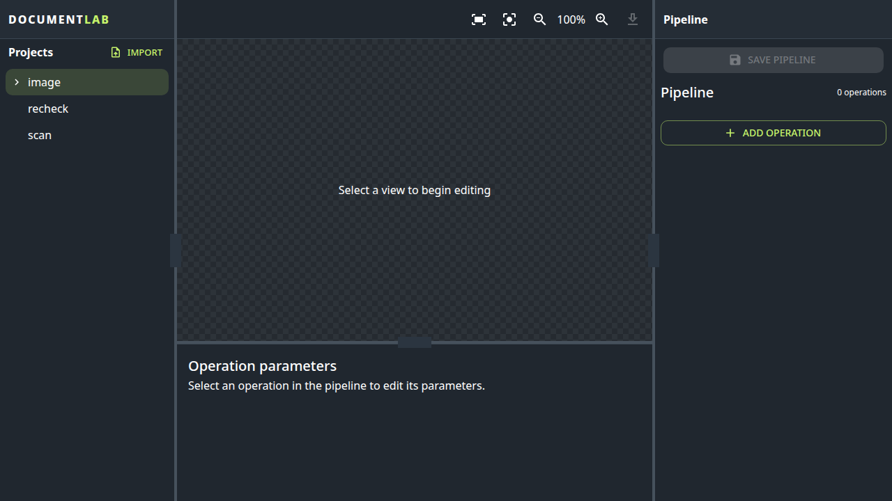

# DocumentLab

DocumentLab is an extensible, procedural image editor with a browser client and a server-side processor. Import a PNG, create named views, arrange image operations into an ordered pipeline, preview changes, and save or download the rendered result.

The processor owns projects, views, pipelines, persistence, rendering order, and the public API. Image operations are discovered from independently running HTTP extension services. A service can be local, containerized, remote, CPU-only, or GPU-backed. The processor only needs its catalog and invocation contract, so an extension's runtime and dependencies remain isolated from the editor.



## Documentation

- [Architecture](docs/ARCHITECTURE.md) explains the client, processor, domain, application, infrastructure, and extension boundaries.
- [Plugin authoring](docs/PLUGIN_AUTHORING.md) is the complete v1 HTTP catalog, schema, render, and helper contract, including tests and deployment.
- The processor publishes its API reference automatically at [`/docs`](http://localhost:8000/docs) and the OpenAPI document at [`/openapi.json`](http://localhost:8000/openapi.json) while it is running.
- [Contributing](CONTRIBUTING.md) covers local development, checks, and change conventions.

## Quick start

### Prerequisites

Install:

- Python 3.10 or newer with [`uv`](https://docs.astral.sh/uv/).
- [Bun](https://bun.sh/) for the client.
- A browser supported by Playwright if you want to run the browser tests.

### Run the full development stack

From the repository root:

```bash
just dev
```

This starts the core extension service on port `9101`, the processor on port `8000`, and the Bun development server on port `3000`. Open <http://localhost:3000>.

`just dev` supplies `EXTENSIONS_REGISTRY_PATH=extensions.yaml` to the processor. The registry points at the local core extension service. Stop the command with `Ctrl+C` to stop the process group.

### Run components separately

Start the core extension from its project directory:

```bash
cd extensions/core
uv run fastapi dev src/core/app.py --port 9101
```

Start the processor with the repository registry:

```bash
cd processor
EXTENSIONS_REGISTRY_PATH=../extensions.yaml uv run fastapi dev main.py --port 8000
```

Start the frontend:

```bash
cd frontend
bun install
bun run dev
```

The frontend listens on port `3000` by default and proxies `/api` requests to port `8000`. Set `BACKEND_PORT` or `PORT` when the local ports need to change.

## Using the editor

1. Choose **Import** in the Projects panel and select a PNG image.
2. Select the imported project and create a named view.
3. Use **Add operation** to add an operation discovered from the extension registry.
4. Select an operation to edit its schema-defined options. Reorder operations, disable an operation temporarily, or remove it.
5. Use an operation helper, such as auto-trim, when one is available. A helper updates the operation options draft; save or cancel the suggestion from the options pane.
6. Preview edits before saving them. Downloading a view renders the saved pipeline as a PNG.

A project keeps its source PNG and view metadata under the configured project root. A view is a name plus an ordered pipeline. Crop is an ordinary pipeline operation with normalized rectangle options; trim is a separate operation with integer edge-pixel options. An empty pipeline is an identity transform. Disabled operations are retained in the view but skipped during rendering.

## Concepts

### Projects and views

A project has a stable identifier, a display name, one source PNG, and zero or more views. A view is a named, reusable projection of that source. View identifiers increase monotonically and are not reused after deletion.

### Pipelines

Each pipeline entry has a non-empty operation `kind`, an `options` object, and an optional `enabled` flag. The processor folds enabled operations from left to right. Each operation receives the rendered image and dimensions produced by the previous step and returns the next PNG and dimensions.

### Helpers

A helper belongs to one operation. It receives the image at that operation's pipeline position, helper invocation options, and the current operation options. It returns replacement options for that operation only. This keeps automatic actions composable and prevents a helper from silently editing unrelated pipeline entries.

### Operation registry

At startup, the processor reads the YAML registry selected by `EXTENSIONS_REGISTRY_PATH`. It health-checks each source, fetches its catalog and selected schemas, validates them, and builds the active operation registry. `allow_operations` can restrict a source to named kinds. `POST /api/operations/reload` repeats discovery and replaces the registry only after the new set is valid. When no registry path is configured, the processor can use its local extension fallback; the normal development stack uses HTTP discovery.

The repository's core service currently publishes `crop`, `rotate`, `straighten`, `trim`, and `remove_background`, with `auto_straighten` and `auto_trim` helpers. Other services can publish additional operation kinds without importing their code into the processor.

## Repository shape

- `frontend/` contains the React/Bun client.
- `processor/` contains the FastAPI processor and its domain, application, infrastructure, and configuration layers.
- `extensions/` contains independently runnable extension services. The core service is the default local service.
- `docs/` contains architecture and extension authoring documentation.
- `extensions.yaml` configures extension discovery for local development.
